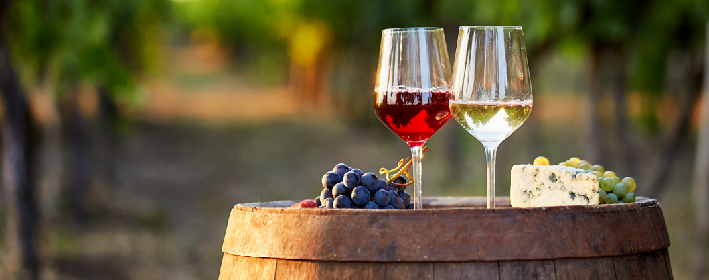
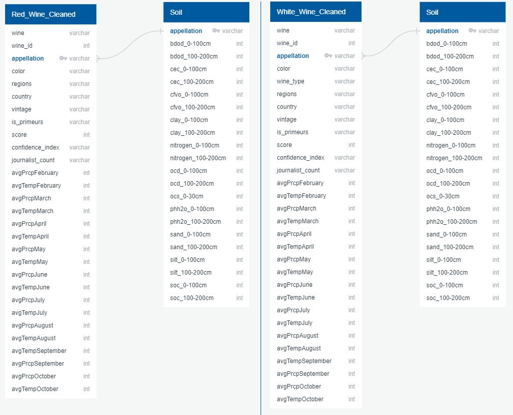
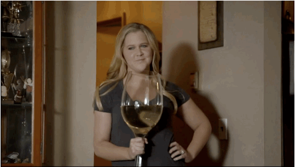

# *Partners In Wine*

## First Segment of four 10.18.2020 

Group #5 , Sonia , Val, Shawn, Neal, Viral and Meredith. 

## Second Segement of four 11.01.2020

Group #5, Sonia , Val, Shawn, Neal, Viral and Meredith 

## Selected topic:

Weather and soil conditions affecting wine quality

## Reason we selected the topic:

We like wine , diverse dataset, enough information to pull across three API's. One for red and white wine , one for weather and one for soil. 

## Description of the source of data:

* Wine API - https://www.globalwinescore.com/api/ 
* Weather API - https://www.ncei.noaa.gov/access/search/data-search/global-summary-of-the-year
* Weather Analysis - https://www.evineyardapp.com/blog/2019/01/17/climate-weather-and-vineyard-management/

## Resources

Data Source:  Python 3.7.6, Anaconda 4.8.4, Jupyter Notebook 6.0.3, Google Colaboratory, spark 3.0.1, java-11, PostgreSQL11.8 (pgAdmin 4.23)
 
## Technologies Used

### Data Cleaning and Analysis

Pandas will be used to clean the data and perform an exploratory analysis. Further analysis will be completed using Python.

### Database Storage

PostgreSQL will be the database we intend to use to store data.

### Machine Learning

SciKitLearn is the ML library we'll be using to create a classifier.  Deep neural network, Random Forest, and Logistic regression were used to train our model.

### Dashboard

Tableau will be used to connect the database and create visualizations. 
***Link to our goolge slide storyboard:  [Wine Quality Dashboard Outline](https://docs.google.com/presentation/d/1EcvvVfTKL4tIiHU0a4hKMTTqq7IEtSOj4YtlxHUAT4Q/edit?usp=sharing)

## Communication Protocols

Communicate through Slack.  Everyone uploads data to their Github branch and create a pull request.  Sonia merges the data after everyone discuss the final plans. 

## Outline of project 

#### Presentation 

  ##### Google Slides 
  ***Link to rough draft of our presentation on google slides:[Wine Quality Machine Leanring](https://docs.google.com/presentation/d/1-MctTWS8TrRcArjXzD5Xvzrx4bVrTv7aOP1SWWkiZ2g/edit?usp=sharing)

#### Github 

  * Each member of team has there own branch and makes at least 4 commits per week 
  * README.MD 

#### Data exploration 

This step involved importing APIs to call weather, wine and soil data. The data was collected from Global Wine Scores, NOAA, and the USGS website. It was then cleaned and finally merged together. Data was split between white wine and red wine before the weather and soil data was merged with it. The Global Wine Scores website has data for wines, the regions that they were grown in, and the scores associated with each wine. These vintages range from 1992 to 2016 and have an average score of approximately 91%. 
 The wine data takes different wines and scores going back to 1992.

Some of the challenges for finding the best weather data was to find zip codes that have reliable temperature and precipitation data. Most of the zip codes had data that originated before 1992 but the stations had missig dates for temperature, precipitation, or both of the values. The process for finding optimal stations involved an iterative process of importing different zip codes for temperature data and different zip codes for precipitation data to determine which zip codes have the best coverage of data. Another challenge to merging weather and wine data was that several appellations (regions) within a state straddled two different zip codes. One of the assumptions this study has made was that weather data would be the same for zip codes that were within 50 mile radius of one another. This allowed the group to assign zip codes for certain appellations and allowed the data to be merged together more succinctly. The wine data comes from wine that is concentrated in Washington State, Oregon, Napa Valley California, Sonoma County California, and the Santa Cruz Mountains in California as well. There were some appellations that only have one or two data points that were dropped from the study.

 #### Database 

  The data was connected through primary keys (unique values in the main table). See the ERD of Red Wine and White Wine below:
  

Once the relationship of the database was created, we use AWS to read and write data from our notebook to and from SQL. In SQL, we join soil table to the red wine table, and soil table to the white table. [SQLQuery](https://github.com/soijebor/Wine_Weather/blob/main/Wine_join.sql)
[Database Notebook](https://colab.research.google.com/drive/1VZLidDt7rMeo9TxoEEyR0zL_bbrxcGTJ?usp=sharing)

### Analysis

Look at results from wine data alone, wine data with weather data, wine data with soil data and wine data with weather and soil data. 
  
#### Machine Learning Module 

[Red Wine ML Notebook](https://colab.research.google.com/drive/1WkwaS39cydCKG4UDTj3ZkPOxPKXn4VY7?usp=sharing)
[White Wine ML Notebook](https://colab.research.google.com/drive/1-_BtJxo7SUc-Q6tVwCBjJzZ3cLfpf-Jg?usp=sharing)

1.) Description of preliminary data preprocessing :

 I started by loading the data into a panda Dataframe, then I followed these steps:

 * Checked and dropped null values
 * Convert the score column from float to integer and split score into good(1) and bad(0) and making it its own column "quality" to use as our target. 
 * Checked for number of unique values in each column to find out which columns required binning and binned appellation. 
 * Created the OneHotEncoder instance,  Fitted the encoder and produce encoded DataFrame and renamed encoded columns.
 * Merged one-hot encoded features and drop the originals

2.) Description of preliminary feature engineering and preliminary feature selection, including their decision making process:

We decided to use the wine score to determine the quality of wine and for feature we decided to look at wine data by itself, wine data with weather data, wine data with soil data and wine data with weather and soil data.

3.) Description of how data was split into training and testing sets:

For splitting the data into training and testing sets I used sklearn train_test_split to split the dataset into random train and test subsets.

4.) Explanation of model choice, including limitations and benefits :

  ## Red Wine

  * For the Deep Learning Neural Network, we got an accuracy of 87% for red wine, 86% for red wine with weather, 87% for red wine with soil and 85% for red wine with weather and soil.
  * For Random Forest Classifier, we got an accuracy of 100% for red wine, 99% for red wine with weather, 100% for red wine with soil and 98% for red wine with weather and soil.
  * For Logistic Regression, we got an accuracy of 95% for red wine, 97% for red wine with weather, 95% for red wine with soil and 95% for red wine with weather and soil. 

  ## White Wine

  * For the Deep Learning Neural Network, we got an accuracy of 75% for white wine, 80% for red wine with weather, 79% for white wine with soil and 80% for white wine with weather and soil. 
  * For Random Forest Classifier, we got an accuracy of 100% for white wine, 95% for white wine with weather, 97% for white wine with soil and 94% for white wine with weather and soil. 
  * For Logistic Regression, we got an accuracy of 90% for white wine, 90% for white wine with weather, 90% for white wine with soil and 90% for white wine with weather and soil. 

 ## Benefits & Limitations
 
* Deep Learning Neural Network -  The limitation of the model is that it requires a large amount of data and it's not easy to comprehend. The benefits of this model can solve complex problems.
* Random Forest Classifier - The limitation is that features need to have some predictive power to work. The benefit is handling of huge amount of data, No problem of overfitting
* Logistic Regression - The limitation of the model is  that  it can be easily outperformed by sturdier model like  Neural Networks,  also its high reliance on a proper presentation of your data. The benefits of this model are that it's easier to implement,  very efficient to train and it outputs well-calibrated predicted probabilities.
  

## Questions the team hopes to answer with the data:

* How does weather impact wine quality?
    * How do wine scores correlate with rain, temperature, humidity, and sunlight? Averages ? How can we use this to predict wine quality ? 
    * How does score vary by region in USA , by type ( red, white) ?
    
* How does soil quality affect wine quality ?

* Wine by wine ID yearly prediction , by region
